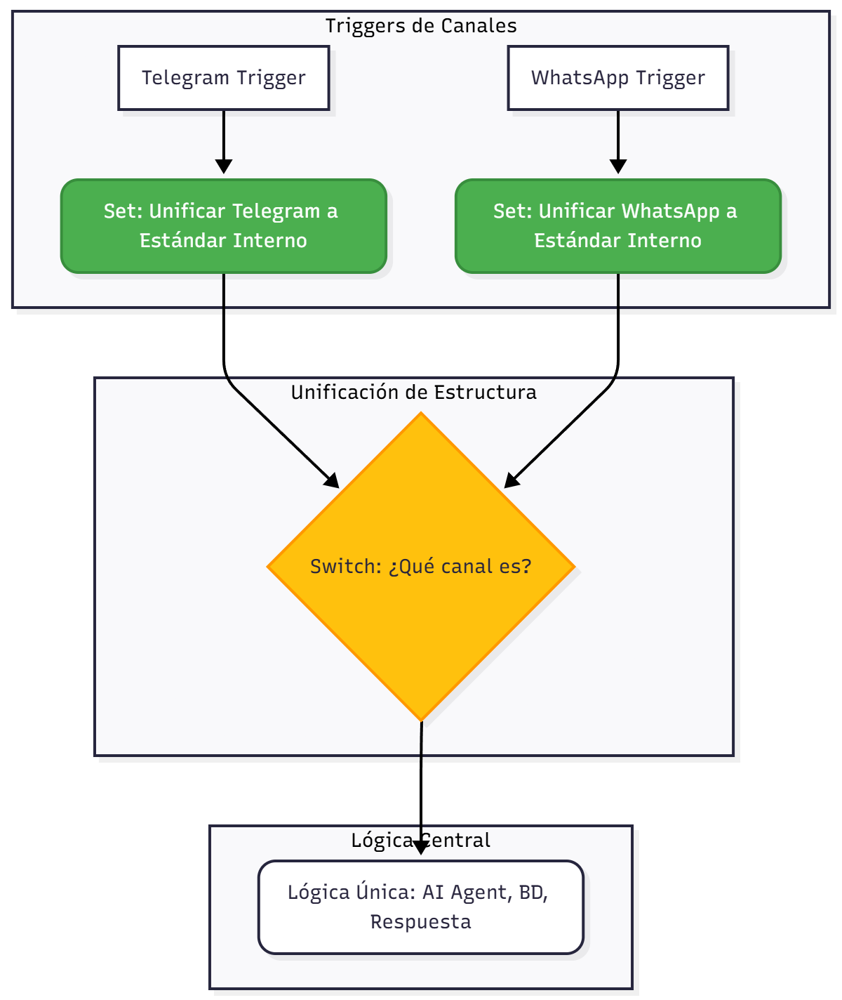

# Estructuras de datos en Telegram y WhatsApp.

Por predeterminado no existe una estructura de datos única y estandarizada que funcione por defecto para ambas APIs de WhatsApp y Telegram. Cada plataforma, incluyendo Meta (WhatsApp) y Telegram, utilizan su propia estructura JSON nativa para los webhooks que envían a nuestro workflow.

Sin embargo, en n8n, podemos crear nuestra propia estructura de datos unificada internamente. Esto es esencial si deseas construir un bot omnicanal que use la misma lógica de negocio sin preocuparse por el origen del mensaje.

## Estrategia para Crear una Estructura Unificada

Para lograr la unificación, debemos mapear los campos esenciales de cada plataforma a un objeto JSON estándar que nosotros podamos definir. Esto se hace inmediatamente después de los nodos Trigger con el uso de un nodo SET o Code.

### 1. Definir la Estructura Única (El Estándar Interno)

Define un objeto simple que contenga solo los datos que nuestro workflow necesita para la lógica central (IA, BD, Respuesta, etc):

| **Campo Unificado** | **Tipo de Dato**  | **Propósito** |
| ------------------- | ----------------- | ------------- |
| `channel`           | String            | `'whatsapp'` o                                            `'telegram'` |
| `user_id`           | String / Number   | El ID único del remitente                  (necesario para la auditoría). |
| `chat_id`           | String / Number   | El ID de la conversación                  (necesario para responder). |
| `user_name`         |            String | Nombre del usuario.|
| `message_text`      | String            | El cuerpo del mensaje de                                                 texto. |

## 2. Implementación con el Nodo "Set" o "Code"

Justo después de cada **Trigger** (WhatsApp o Telegram), debes añadir un nodo (**Set** o **Code**) que se encargue de mapear los datos entrantes a tu estructura unificada.

### A. Mapeo para Telegram

| **Campo Unificado** | **Expresión de n8n para Telegram** |
| --------------------|----------------------------------- |
| `channel`           |                       `'telegram'` |
| `user_id`           |      `{{ $json.message.from.id }}` |
| `chat_id`           |      `{{ $json.message.chat.id }}` |
| `user_name`         | `{{ $json.message.from.first_name + ' ' +                         $json.message.from.last_name }}` |
| `message_text`      |         `{{ $json.message.text }}` |

**B. Mapeo para WhatsApp**

| **Campo Unificado** | **Expresión de n8n para WhatsApp** |
| --------------------|----------------------------------- |
| `channel`           |                       `'whatsapp'` |
| `user_id`           | `={{ $json.entry[0].changes[0].value.messages                                      [0].from }}` |
| `chat_id`           | `={{ $json.entry[0].changes[0].value.messages                                      [0].from }}` |
| `user_name`         | `={{ $json.entry[0].changes[0].value.contacts                              [0].profile.name }}` |
| `message_text`      | `={{ $json.entry[0].changes[0].value.messages                                      [0].body }}` |

## **3. Flujo Lógico con Estructura Unificada**

Nuestro workflow final en n8n debería usar un nodo **Merge** o **Switch** para manejar los diferentes *Triggers* y luego, inmediatamente, un nodo **Set** para la unificación.

Al hacer esto, toda la lógica central (AI Agent, auditoría en PostgreSQL, etc.) solo necesitara leer los campos de tu estructura unificada (`$json.user_id`, `$json.message_text`), haciendo que tu automatización sea verdaderamente omnicanal.